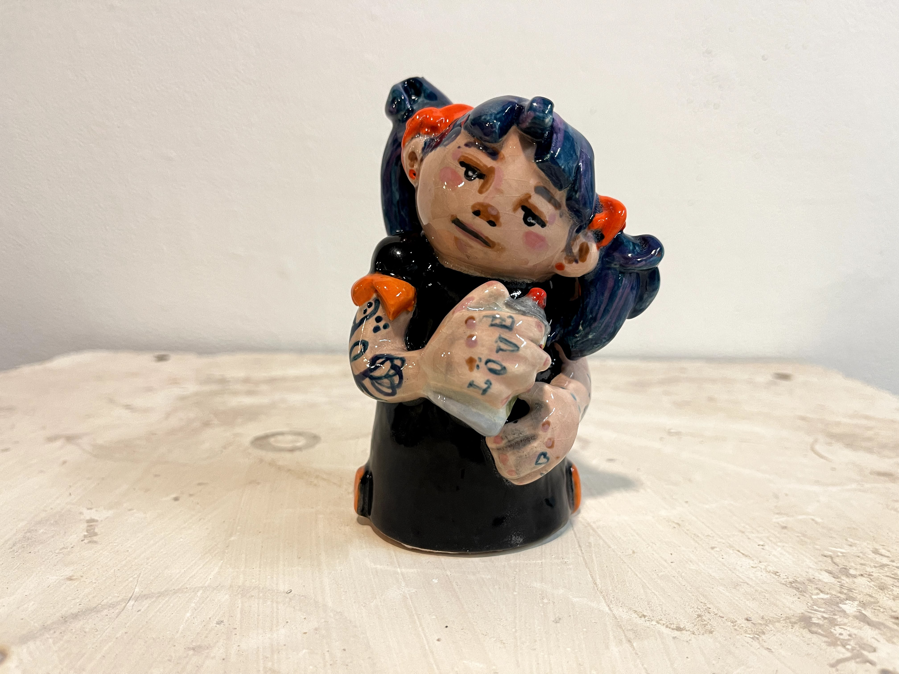
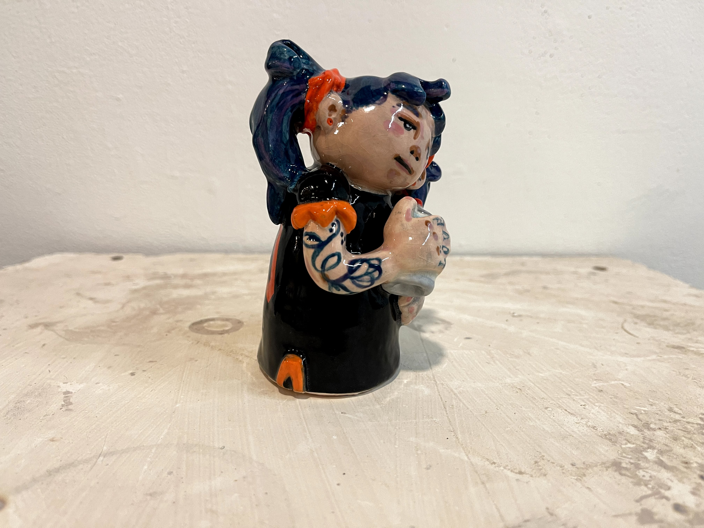
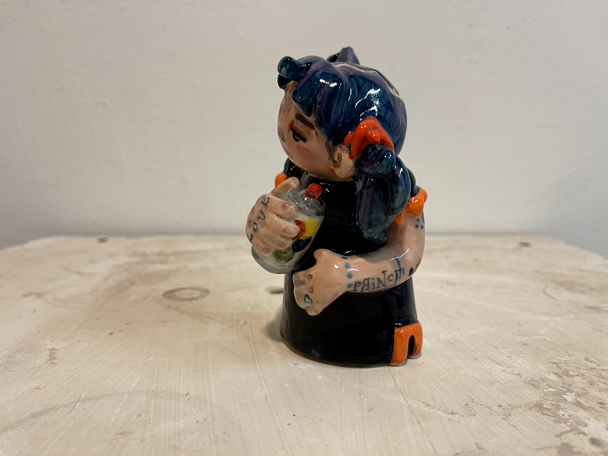
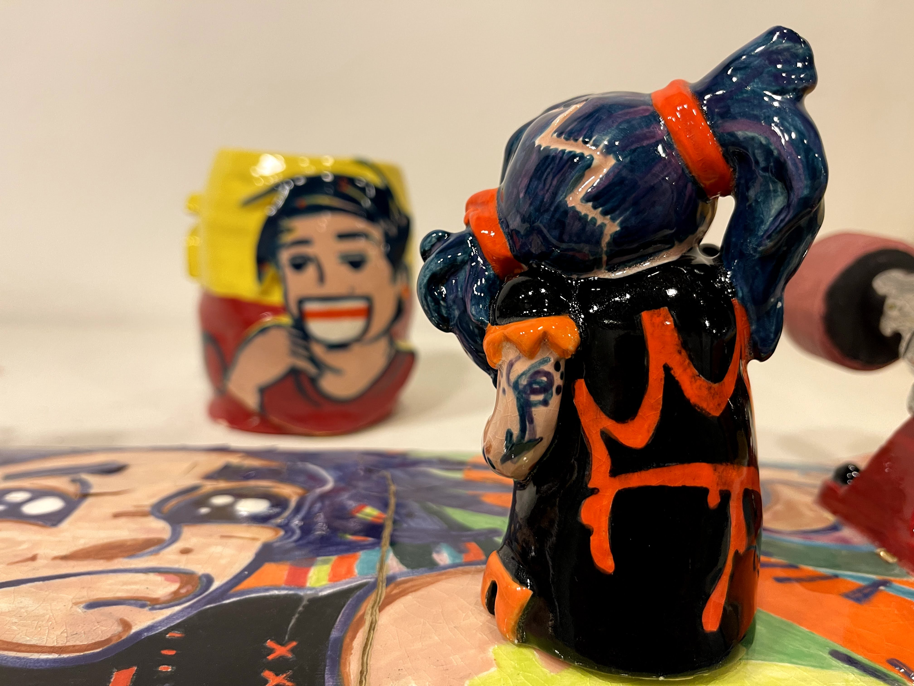

&nbsp;&nbsp;
&nbsp;&nbsp;
 
## Untitled 
**2021** 
Material: Ceramic  

*dimensions: 12,7cm(H) x 7.62cm(W)  |  5"(H) x 3"(W)*  
*Handmade & hand painted.*  
*Image courtesy of the artist.*  

*Inspired by Hopi Katchinas and the Japanese Kokeshi*   
